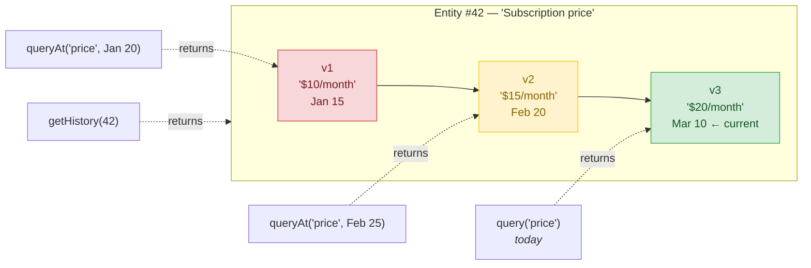

# Kalairos

[](https://www.npmjs.com/package/kalairos)
[](https://www.npmjs.com/package/kalairos)
[](https://github.com/LabsKrishna/kalairos/blob/main/LICENSE)
[](https://www.npmjs.com/package/kalairos)

> **Most systems store what is true. Kalairos stores what was true when decisions were made.**

---

## The problem nobody talks about

Your agent stores a fact. The fact changes. Now you're stuck.

```js
await memory.remember('Employees must submit reports by Friday');
// ...two weeks later, policy changes...
await memory.remember('Deadline changed to Wednesday');
```

A user gets penalized for missing Wednesday's deadline.
They protest: *"I followed the rule. Why was I punished?"*

Your system shrugs. It only knows the **latest** rule. The old one is gone.

> Every vector DB has this bug. They overwrite. Or they duplicate and confuse retrieval. Either way, **history disappears.**

This is not a niche problem. It is every:

- **Policy change** that gets applied retroactively
- **Pricing dispute** where a customer signed up at the old rate
- **Compliance audit** asking *"what was your retention rule on March 12?"*
- **Code review** flagging old code against new rules
- **AI assistant** that contradicts itself because user preferences shifted

If your agent can't answer *"what did we believe at the time?"*, it cannot be trusted to make decisions that outlive a single session.

---

## The fix, in one call

```js
await kalairos.remember('Employees must submit reports by Friday');
await kalairos.remember('Deadline changed to Wednesday');

// Today
await kalairos.query('report deadline');
// → "Deadline changed to Wednesday"

// What was true last week?
await kalairos.queryAt('report deadline', lastWeek);
// → "Employees must submit reports by Friday"
```

That's it. Same memory. Two answers. Both correct — for their moment in time.

**Without Kalairos:** the system only knows the latest rule. The user looks wrong.
**With Kalairos:** the system knows what was true *then*. The user can prove they were right.

---

## Install

```bash
npm install kalairos
```

Local-first. No cloud service. No API key required. Bring any embedder. JSONL on disk — human-readable, git-friendly, easy to back up.

```bash
npx kalairos demo    # interactive demo, zero config
```

---

## Layer 1 — Three calls and you're done

`init`, `remember`, `query`. Most agents need nothing more.

```js
const kalairos = require('kalairos');
const embed = async (t) => [...t].map(c => c.charCodeAt(0) / 255); // toy embedder

await kalairos.init({ embedFn: embed });

await kalairos.remember('User prefers concise bullet points');
await kalairos.remember('Customer is on the $10/month plan');

const { results } = await kalairos.query('what plan are they on?');
console.log(results[0].text);
```

Swap the toy embedder for OpenAI, Cohere, or any `async (text) => number[]` when you're ready.

---

## Layer 2 — Time-aware memory

Once the basic loop makes sense, time-travel is one call away. `remember()` detects updates automatically and appends a new version. `queryAt(text, timestamp)` recalls whichever version was current at that moment. `getHistory(id)` returns the full trail.

```js
const id = await kalairos.remember('Subscription price is $10/month');

// ...later, pricing changes...
await kalairos.remember('Subscription price increased to $20/month');

// Current state
const now = await kalairos.query('subscription price');
console.log(now.results[0].text);     // → "$20/month"

// What did we charge this customer when they signed up?
const signupDate = new Date('2025-03-01').getTime();
const past = await kalairos.queryAt('subscription price', signupDate);
console.log(past.results[0].text);    // → "$10/month"

// Full version history with deltas and provenance
const history = await kalairos.getHistory(id);
history.versions.forEach(v => console.log(`v${v.version}: ${v.text}`));
```

One entity, many versions. Every query picks the version current at its chosen moment.



Versions are **linear per entity** — each new version supersedes the previous; there is no branching. The "fork" effect happens *across* entities: when a `remember()` falls below the similarity threshold, it creates a new entity instead of a new version. Linearity is what keeps `queryAt(t)` well-defined: there is always one unambiguous answer to *"what did we believe about entity X at time T."*

---

## Every change leaves a breadcrumb. Important moments become checkpoints.

Every `remember()` writes a trail event with `who` did it, `why`, when it became *effective*, and when it was *ingested*. Nothing extra to call. The trail is read-only and pure — `trail()` projects it from data already on disk.

```js
const policy = kalairos.scope({ source: { type: "agent", actor: "policy-bot" } });

await policy.remember("Employees must submit reports by Friday");
await policy.remember("Deadline changed to Wednesday", {
  why:         "Policy update from HR memo",
  effectiveAt: "2026-04-15",
});

const events = await kalairos.trail({ action: ["remembered", "superseded"] });
// → [{ action: "remembered", who: { agent: "policy-bot" }, ingestAt, effectiveAt, ... },
//    { action: "superseded", who: { agent: "policy-bot" }, why: "Policy update from HR memo", ... }]
```

Each event is one of a closed set: `remembered`, `superseded`, `corrected`, `contested`, `reaffirmed`, `forgotten`, `restored`, `imported`, `annotated`. Switch on it without guessing.

When a moment matters — quarter close, audit cut, model ship — name it:

```js
await kalairos.checkpoint("q1-close", {
  during: ["2026-01-01", "2026-04-01"],
  why:    "Q1 audit reference",
});

const q1 = await kalairos.trail({ checkpoint: "q1-close" });
const lastWeek = Date.now() - 7 * 86_400_000;
const past     = await kalairos.queryAt("report deadline", lastWeek);
```

Checkpoints are frozen by default — backdated writes do not silently join them. Pass `live: true` if you want the filter to re-evaluate on every read.

---

## Where this earns its keep

| Scenario | The pain | What `queryAt` proves |
|---|---|---|
| **Policy change** | "I was penalized for breaking a rule that didn't exist when I acted." | The rule that applied on the date of the action. |
| **Pricing dispute** | "I signed up at $10. Why am I being charged $20?" | The price at the moment of signup. |
| **Compliance audit** | "What was your data retention policy on March 12?" | The policy as it stood on March 12. |
| **Engineering review** | Old code flagged against rules that didn't exist when it was written. | The rule as it was when the code was committed. |
| **Drifting AI agent** | Assistant flips between contradictory user preferences with no record of why. | The preference at any past turn — and the full trail of changes. |

If your product makes promises that outlive the moment, you need memory that does too.

---

## Layer 3 — Advanced maintenance

Reach for these only when you need them. The 3-function path covers most agents.

### Trust and annotations

Every query result includes a `trust` score and a `source` provenance chain. Annotate an entity with trust signals without creating a new content version:

```js
await kalairos.annotate(id, { trustScore: 0.9, verified: true, notes: 'confirmed by finance' });
```

### Consolidation

Merge near-duplicate memories into a single entity. Useful at the end of long sessions.

```js
const { merged, totalMerged } = await kalairos.consolidate({ threshold: 0.9 });
```

### Contradiction inspection

When a new version contradicts a prior one, the delta is flagged. Surface the conflict instead of silently overwriting:

```js
const { contradictions } = await kalairos.getContradictions(id);
contradictions.forEach(v => console.log(`v${v.versionId}: ${v.delta.summary}`));
```

### Provenance defaults with `scope()`

If every write from one part of your agent shares the same source / classification / tags, `scope()` pre-fills them so you don't pass them every call. Reads behave exactly like the flat API.

```js
const support = kalairos.scope({
  source: { type: 'agent', actor: 'support-bot' },
  classification: 'confidential',
  tags: ['support'],
});

await support.remember('Customer reports checkout is broken on mobile');
const { results } = await support.query('checkout');
```

`scope()` is optional sugar. Everything it does is expressible with the flat API.

---

## What Kalairos gives you

|                                | Plain vector store     | Kalairos                             |
| ------------------------------ | ---------------------- | ------------------------------------ |
| **Updates**                    | Overwrite or duplicate | Automatic versioning                 |
| **History**                    | None                   | Full version trail with deltas       |
| **"What was true on Jan 15?"** | Can't answer           | `queryAt` any timestamp              |
| **Contradictions**             | Invisible              | Auto-detected between versions       |
| **Provenance**                 | Not tracked            | Who stored it, when, from where      |
| **Retrieval**                  | Cosine similarity      | Semantic + graph + keyword + recency |
| **Deployment**                 | Cloud SDK              | Local-first, zero cloud dependency   |
| **Embedding model**            | Bundled or locked in   | BYO — any provider, any model        |

---

## API stability

Kalairos follows semver. Within the `1.x` line, the signatures of **`init`, `remember`, `query`, `queryAt`, `getHistory`** are **frozen**. Additive fields land in minor releases; any breaking change bumps the major version. Deprecated APIs emit warnings for at least two minor versions before removal.

---

## Benchmarks

All numbers from `npm run bench` — deterministic bag-of-words embedder, no API key needed. Reproducible on any machine.

| Metric                      | Score                            | What it measures                                      |
| --------------------------- | -------------------------------- | ----------------------------------------------------- |
| **Recall@5**                | 75% (finance), 50% (engineering) | Fraction of relevant items in top-5 results           |
| **Precision@3**             | 100% (health)                    | Fraction of top-3 results that are relevant           |
| **MRR**                     | 1.0                              | First relevant result appears at rank 1               |
| **Temporal accuracy**       | 100%                             | `queryAt` time-travel returns correct historical version |
| **Contradiction detection** | 100%                             | Value changes flagged across all scenarios            |
| **Cross-session recall**    | 100%                             | Memories persist across agent sessions                |

These numbers use a bag-of-words embedder (no neural model). With OpenAI `text-embedding-3-small` or Cohere embeddings, expect recall@5 > 90%.

```bash
npm run bench          # full suite
npm run bench:real     # real embeddings (requires OPENAI_API_KEY)
```

See [BENCH.md](BENCH.md) for the full suite.

---

## API reference

### Lifecycle

```js
await kalairos.init({ embedFn, llmFn?, embeddingDim?, dataFile?, ...overrides })
await kalairos.shutdown()
```

### Write

```js
await kalairos.remember(text, opts?)
await kalairos.ingest(text, opts?)                  // power-user / batch path
await kalairos.ingestBatch(items)
await kalairos.ingestFile(filePath, opts?)
await kalairos.ingestTimeSeries(label, points, opts?)
```

Options: `{ type, timestamp, metadata, tags, source, classification, retention, memoryType, workspaceId, useLLM, importance, forceNew }`.

### Read

```js
await kalairos.query(text, { limit?, maxTokens?, filter? })
await kalairos.queryAt(text, timestamp, { limit?, maxTokens?, filter? })
await kalairos.queryRange(text, since, until, { limit?, maxTokens?, filter? })
await kalairos.get(id)
await kalairos.getMany(ids)
await kalairos.getHistory(id)
await kalairos.listEntities({ page?, limit?, type?, since?, until?, tags?, memoryType?, workspaceId? })
await kalairos.getGraph()
await kalairos.traverse(id, depth?)
await kalairos.getStatus()
```

### Delete

```js
await kalairos.remove(id, { deletedBy? })           // soft delete
await kalairos.forget(id, { reason?, who? })        // first-class verb, audited
await kalairos.restore(id, { reason?, who? })       // reverse a forget
await kalairos.purge(id)                            // permanent hard delete
```

### Audit trail and checkpoints

```js
await kalairos.trail({ entity?, since?, until?, action?, who?, checkpoint?, limit? })
await kalairos.checkpoint(name, { during?, entity?, tags?, workspace?, why?, live? })
await kalairos.getCheckpoint(name)
await kalairos.listCheckpoints({ workspace? })
```

### Maintenance

```js
await kalairos.annotate(id, { trustScore?, verified?, notes?, memoryType? })
await kalairos.consolidate({ threshold?, dryRun? })
await kalairos.getContradictions(id)
await kalairos.getDrift(id)
```

### Scoped handle

```js
const scope = kalairos.scope({ source?, classification?, tags?, memoryType?, workspaceId? })
await scope.remember(text, opts?)
await scope.query(text, opts?)
await scope.queryAt(text, timestamp, opts?)
await scope.getHistory(id)
await scope.getContradictions(id)
await scope.annotate(id, opts?)
await scope.remove(id, { reason?, deletedBy? })
```

### Signals

```js
kalairos.onSignal(code, callback)
kalairos.getSignals(code?)
```

---

## Configuration

| Variable                         | Default | Description                                |
| -------------------------------- | ------- | ------------------------------------------ |
| `KALAIROS_LINK_THRESHOLD`        | `0.72`  | Similarity threshold for graph linking     |
| `KALAIROS_VERSION_THRESHOLD`     | `0.82`  | Similarity threshold for version detection |
| `KALAIROS_GRAPH_BOOST`           | `0.01`  | Graph relationship boost weight            |
| `KALAIROS_LLM_BOOST`             | `0.08`  | LLM keyword boost weight                   |
| `KALAIROS_IMPORTANCE_WEIGHT`     | `0.05`  | Importance boost weight in query scoring   |
| `KALAIROS_RECENCY_WEIGHT`        | `0.10`  | Recency boost weight                       |
| `KALAIROS_RECENCY_HALFLIFE_DAYS` | `30`    | Recency half-life in days                  |
| `KALAIROS_MIN_SCORE`             | `0.45`  | Minimum final score for results            |
| `KALAIROS_MIN_SEMANTIC`          | `0.35`  | Minimum semantic similarity                |
| `KALAIROS_MAX_VERSIONS`          | `0`     | Max versions per entity (0 = unlimited)    |
| `KALAIROS_STRICT_EMBEDDINGS`     | `1`     | Require embedder (`0` to disable)          |
| `KALAIROS_PORT`                  | `3000`  | HTTP server port                           |

---

## Storage

- Persisted locally to `data.kalairos` (configurable via `dataFile`)
- Atomic writes to reduce corruption risk
- Pass `dataFile: ":memory:"` for in-memory-only mode

---

## HTTP server

```bash
npx kalairos          # starts on localhost:3000
```

Core endpoints mirror the flat API (`/remember`, `/query`, `/history/:id`, etc.). See `server.js` for the full route list.

---

## Markdown export / import

Memory is portable and diffable.

```bash
npx kalairos export --out memory.md --include-history   # dump to markdown
npx kalairos import memory.md                           # ingest back
```

Checkpoint it into git, share it across agents, hand-edit it when debugging.

---

## Migration note — `createAgent()` → `scope()`

`createAgent()` is deprecated. It still works, and emits a one-time deprecation warning on first call. Removal is targeted for 2.0.

```js
// before
const agent = kalairos.createAgent({
  name: 'budget-planner',
  defaultClassification: 'confidential',
  defaultTags: ['finance'],
});
await agent.remember('Q2 budget is 2.4M');
await agent.recall('Q2 budget');

// after
const scope = kalairos.scope({
  source: { type: 'agent', actor: 'budget-planner' },
  classification: 'confidential',
  tags: ['finance'],
});
await scope.remember('Q2 budget is 2.4M');
await scope.query('Q2 budget');
```

Old method names on the handle (`recall`, `recallAt`, `update`, `forget`, `boot`, `learnFrom`, `consolidateSession`) remain as silent aliases on `scope()` for back-compat.

---

## Feedback

We'd love to hear how you're using Kalairos — what works, what's missing, what you'd build on top of it.

Reach us at **main@krishnalabs.ai**

---

## License

MIT — [KrishnaLabs](https://krishnalabs.ai)
